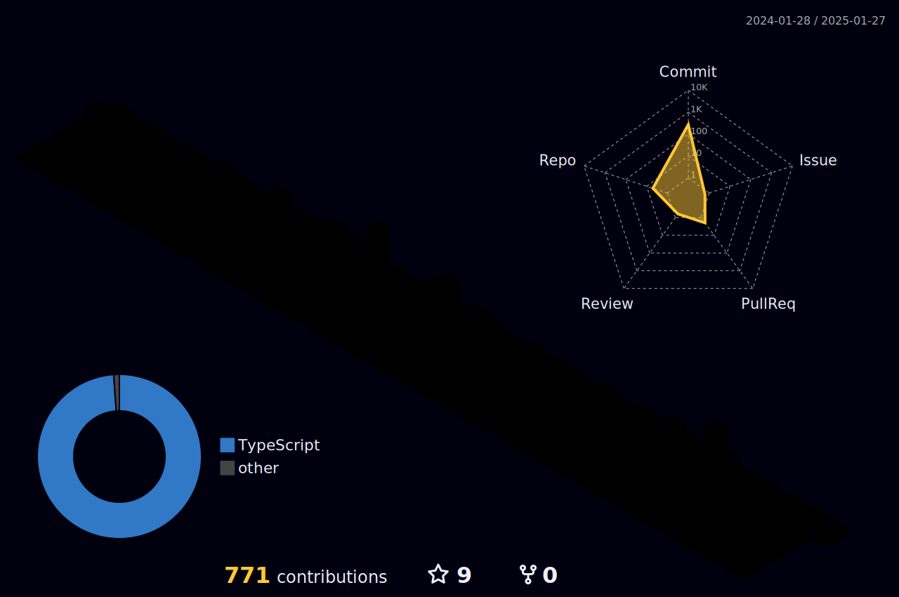

<h1 align="center"> Heey, I'm Carlos Eduardo ✌️😅 </h1>

- 👨‍💻 I’m currently working as a Front-end Developer.  
- 💻 I’m always free to learn new things and technologies.  
- 📫 How to reach me: ⬇ ⏬  

 

   
  

  
 |  |  |  
 | ----------- | ----------- |

  <h2 align="center"> Technologies I work with </h2>
  
   

##

  

